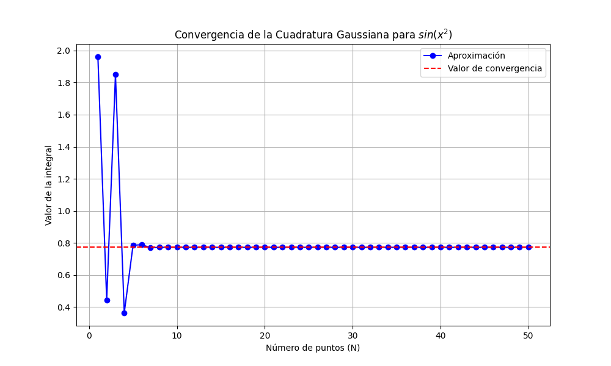

# Tutorial: Implementación y Análisis Paso a Paso

En este tutorial aprenderá a utilizar las herramientas del módulo `quadrature.py` para resolver problemas de integración numérica, enfocándonos en la integral proporcionada.

## 1. Obtención de Nodos y Pesos Estándar

El primer paso en la Cuadratura Gaussiana consiste en determinar los puntos de evaluación (nodos) y los pesos asociados en el intervalo estándar [-1, 1].

```python
import numpy as np
from quadrature import gaussxw

# Definimos el número de puntos de evaluación (N)
N = 3

# Obtenemos los nodos (x) y los pesos (w) en [-1, 1]
x, w = gaussxw(N)

print("Nodos estándar (x):", x)
print("Pesos estándar (w):", w)
```

## 2. Transformación al Intervalo General [a, b]

Dado que nuestra integral está en el intervalo [0, \pi], usamos la función `gaussxwab` para reescalar los nodos y los pesos al dominio físico del problema mediante un mapeo lineal.

```python
from quadrature import gaussxwab

# Definimos los límites de integración y el número de puntos
a = 0
b = np.pi
N = 10

# Obtenemos los puntos y pesos escalados al intervalo deseado
xp, wp = gaussxwab(N, a, b)

print("Puntos escalados (xp):", xp)
print("Pesos escalados (wp):", wp)
```

## 3. Ejemplo Completo: Resolviendo la Integral de Fresnel

Uniremos todas las piezas para resolver la integral propuesta en la tarea:
$$I = \int_{0}^{\pi} \sin(x^2) dx$$

Este bloque de código muestra la implementación final mediante una suma pesada, que es la esencia de la Cuadratura Gaussiana.

```python
import numpy as np
from quadrature import gaussxwab

# 1. Definición de la función objetivo (Integral de Fresnel)
def f(x):
    return np.sin(x**2)

# 2. Configuración de parámetros para la resolución
a = 0
b = np.pi
N = 10  # Número de puntos para una precisión inicial

# 3. Cálculo de puntos de colocación y pesos escalados
x, w = gaussxwab(N, a, b)

# 4. Cálculo de la integral (Suma pesada de f(x_i) * w_i)
I = np.sum(w * f(x))

print(f"El resultado de la integral para N={N} es: {I}")
```

## 4. Estudio de Convergencia del Método

Un aspecto crítico en la física computacional es determinar cuántos puntos de evaluación (N) son necesarios para obtener un resultado confiable. Podemos observar este comportamiento mediante el siguiente análisis iterativo:

```python
# Analizando la estabilidad del resultado según N
for n_puntos in range(1, 11):
    x, w = gaussxwab(n_puntos, 0, np.pi)
    integral = np.sum(w * f(x))
    print(f"N = {n_puntos:2d} | Aproximación: {integral:.6f}")
```

### Visualización de Resultados

Como se puede apreciar en el gráfico generado por el script `quadrature.py`, la solución se estabiliza rápidamente. Esto demuestra la superioridad de la Cuadratura Gaussiana frente a métodos de orden inferior para funciones suaves pero oscilatorias.



> **Nota:** Se verificó que para N=15 el resultado es estable hasta la quinta cifra decimal.
